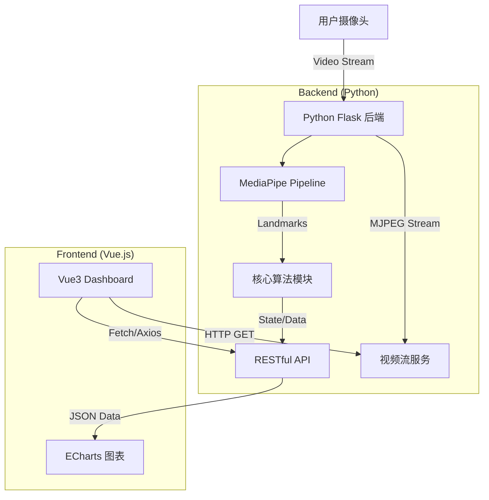

# 🛡️ FocusGuard: AI 智能坐姿与专注度健康卫士

   

> **2025 Python 语言程序设计课程大作业**
>
> 组名：关键问题是问题的关键 | 成员：张天译 赵迎迎 龙辅仁 李紫嫣 | 截止日期：2025-12-31

## 📖 1. 项目介绍 (Introduction)

**FocusGuard** 是一款基于计算机视觉的桌面端健康辅助系统，旨在解决现代学生和办公人群因长期面对屏幕导致的**不良坐姿**与**视疲劳**问题。

本项目采用**前后端分离 (Separation of Concerns)** 架构开发。后端基于 **Python** 与 Google **MediaPipe** 框架，实时采集并分析用户的面部网格 (Face Mesh) 与身体姿态 (Pose)；前端采用 **Vue.js** 构建现代化交互界面，提供实时的健康状态反馈与可视化的专注度报表。

### ✨ 核心功能 (Key Features)

  * **📐 实时坐姿矫正**：利用几何算法检测肩颈倾斜度与头部前伸距离，实时判定“驼背”、“侧倾”等不良坐姿。
  * **👀 疲劳/专注度监测**：通过计算眼睛纵横比 (EAR) 识别眨眼频率与闭眼时长，结合头部姿态评估用户专注状态。
  * **📊 动态健康看板**：基于 ECharts 的数据可视化大屏，实时绘制专注力曲线与健康评分。
  * **🔔 智能语音提醒**：当检测到异常状态持续超过阈值时，自动触发语音或弹窗提醒。

-----

## 🏗️ 2. 系统架构 (System Architecture)

本项目遵循典型的工程化开发模式，后端负责复杂的计算逻辑，前端负责高效的渲染与交互。



### 🛠️ 技术栈 (Tech Stack)

| 模块 | 技术选型 | 说明 |
| :--- | :--- | :--- |
| **Backend** | **Python 3.9** | 核心开发语言 |
| Web Framework | **Flask** | 轻量级 Web 服务，处理 API 和视频流 |
| CV Engine | **MediaPipe** | Google 开源机器学习框架 (Pose/FaceMesh) |
| Image Process | **OpenCV** | 图像预处理与绘图 |
| **Frontend** | **Vue.js 3** | 渐进式 JavaScript 框架  |
| UI Component | **Element Plus** | 桌面端组件库，保证交互体验  |
| Visualization | **ECharts** | 百度开源可视化库，用于生成报表 |

-----

## 🚀 3. 快速开始 (Quick Start)

请确保本地环境已安装 `Python 3.8+` 和 `Node.js 16+`。

### 3.1 后端环境配置 (Backend)

1.  **克隆仓库**

    ```bash
    git clone https://github.com/your-repo/FocusGuard.git
    cd FocusGuard/backend
    ```

2.  **创建虚拟环境 (推荐)**

    ```bash
    python -m venv venv
    # Windows
    venv\Scripts\activate
    # macOS/Linux
    source venv/bin/activate
    ```

3.  **安装依赖**

    ```bash
    pip install -r requirements.txt
    ```

    *`requirements.txt` 内容示例:*

    ```text
    flask==2.0.1
    mediapipe==0.10.0
    opencv-python==4.5.5
    numpy==1.21.0
    ```

4.  **启动服务**

    ```bash
    python app.py
    ```

    后端默认运行在 `http://localhost:5000`。

### 3.2 前端环境配置 (Frontend)

1.  **进入前端目录**

    ```bash
    cd ../frontend
    ```

2.  **安装依赖**

    ```bash
    npm install
    ```

3.  **启动开发服务器**

    ```bash
    npm run dev
    ```

    前端访问地址通常为 `http://localhost:5173`。

-----

## 📂 4. 目录结构 (Directory Structure)

项目结构清晰，符合软件工程分层规范 。

```text
FocusGuard/
├── backend/                # Python 后端
│   ├── app.py              # Flask 入口文件
│   ├── core/               # 核心算法包
│   │   ├── detector.py     # MediaPipe 封装类
│   │   └── geometry.py     # 几何计算工具 (角度/距离)
│   ├── static/             # 静态资源
│   └── templates/          # (备用) 简单 HTML 模板
├── frontend/               # Vue.js 前端
│   ├── src/
│   │   ├── components/     # Vue 组件 (VideoPlayer, ChartCard)
│   │   ├── api/            # Axios 请求封装
│   │   └── App.vue         # 主视图
│   └── package.json
[cite_start]├── docs/                   # 文档与实验报告素材 [cite: 43]
│   ├── submission_doc.docx # 最终提交文档
│   └── images/             # 演示截图
├── README.md               # 项目说明文档
└── requirements.txt        # Python 依赖列表
```

-----

## 👥 5. 团队分工 (Team)

本项目由 4 人小组协作完成，分工如下 ：

  * **成员 A (龙辅仁)** - *Team Leader & Full Stack*

      * 负责系统架构设计与搭建 (Flask + Vue)。
      * 开发前端 Dashboard 及数据可视化模块。
      * 实现前后端视频流传输 (MJPEG)。

  * **成员 B (赵迎迎)** - *Core Algorithms*

      * **Python 核心实现**：基于 MediaPipe 开发 Pose 和 Face Mesh 识别逻辑。
      * 设计坐姿判定算法（角度计算、阈值设定）。
      * 负责后端数据处理模块。

  * **成员 C (李紫嫣)** - *Backend Logic & Optimization*

      * 设计 RESTful API 接口。
      * 实现用户状态记录与历史数据存储。
      * 代码规范检查与性能优化。

  * **成员 D (张天译)** - *Documentation & Testing*

      * 负责组队登记和最终提交材料的整合。
      * 撰写**实验报告**，**Submission document**，README文件与用户手册 。
      * 负责多场景测试（不同光线、不同坐姿）并记录 Bug。
      * 制作演示视频与 PPT。
      * 统筹进度，确保 12 月 31 日前完成项目。

-----

## 📜 6. 评分标准自查 (Checklist)

  *  **选题实用性**：解决实际健康问题，应用场景明确 。
  *  **工程代码量**：包含完整的前后端代码，架构清晰。
  * **Python 能力**：后端核心算法完全由 Python 实现 。
  *  **用户体验**：界面美观，操作流程顺滑 。

-----

## ⚠️ 注意事项 (Notes)

  * 本项目基于摄像头运行，请确保设备拥有可用摄像头并授予浏览器访问权限。
  * **隐私声明**：所有图像数据仅在本地内存中处理，**不会**上传至云端，保障用户隐私。

-----

> Created with ❤️ by Nankai University Students.

-----
